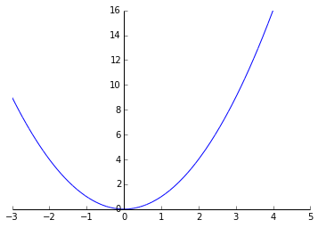
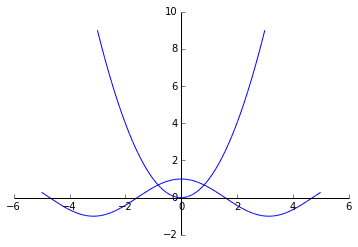

#<div class="alert alert-success">Representación de funciones</div>


```python
from sympy import *
init_printing(use_latex='mathjax')
x, y, z = symbols('x, y, z')
```

El comando básico para dibujar funciones es **plot**. Si solamente le pasamos como argumento una función nos la dibuja en el intervalo (-10,10) del eje $x$. El tamaño del eje $y$ dependerá de la función. Para variar el dominio de la gráfica se le debe añadir como argumento una tupla, que conste de la letra $x$, el límite inferior y el superior.

###<div class="alert alert-warning">Dibuja la gráfica de la función $f(x)=x^2$ en el intervalo $(-3,4)$.</div>


```python
plot(x**2,(x,-3,4))
```





    <sympy.plotting.plot.Plot at 0x6d78950>


A la gráfica de podemos hacer muchas modificaciones, añadiendo argumentos optativos. Algunos de ellos son:

* **ylim**. Para modificar el eje $y$.

* **line_color**. Para cambiar el color.

* **xlabel**. Para poner nombre al eje $x$

* **title**. Para poner un título a la gráfica.

###<div class="alert alert-warning">Varia alguno de los parámetros mencionados.</div>


```python

```

###<div class="alert alert-warning">Modificar el tamaño y guardar la imagen.</div>

Se pueden dibujar varias funciones en la misma gráfica. La manera más sencilla, cuando ambas gráficas tienen el mismo dominio, es escribir las distintas funciones separadas por comas. Sin embargo para controlar individualmente cada función es mejor utilizar otro método, que consiste en realizar "una tupla de tuplas".

###<div class="alert alert-warning">Dibuja,  en unos mismos ejes, las gráficas de una parábola  y del coseno.</div>


```python
plot((x**2,(x,-3,3)), (cos(x),(x,-5,5)))
```





    <sympy.plotting.plot.Plot at 0x944c590>


Con lo visto anteriormente se puede "simular" la gráfica de una función definida a trozos.

###<div class="alert alert-warning">Representa la siguiente función definida a trozos:</div>

$$
f(x)=
\begin{cases}
2x-3 & \mathrm{ si } & -4<x<2\\
x^2 & \mathrm{ si } & -2\leq x <2 \\
x & \mathrm{ si }& 2\leq x <5
\end{cases}
$$
rrrplot((2*x-3,(x,-4,-2)),(x**2,(x,-2,2)),(x,(x,2,5)))

```python

```
