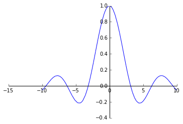

#<div class="alert alert-success">Límites</div>


```python
from sympy import *
init_printing()
x, y, z, h = symbols('x, y, z, h')
```

Para calcular límites se utiliza la función **limit**. Esta función puede admitir 4 argumentos, siendo el último opcional. El primer argumento debe ser la función a que le queremos calcular el límite. El segundo es la variable que haremos variar en el límite. El tercero es el punto hacia el que tiende la variable (para escribir infinito podemos escribir **oo**). El cuarto sirve para los límites laterales: si escribimos **dir = '+'** calculamos el límite por la derecha, y escribiendo **dir 0 '-'** calculamos el límite por la izquierda. Por defecto Sympy calcula los límites por la derecha.

###<div class="alert alert-warning">Calcula la expresión $\displaystyle\frac{\sin(x)}{x}$ para números cercanos a cero, dibuja la función y calcula:


 $$\lim_{x\rightarrow 0}\frac{\sin(x)}{x}$$


```python
plot(sin(x)/x)
```





    <sympy.plotting.plot.Plot at 0x496d690>


###<div class="alert alert-warning">Calcula los límites laterales en $x=0$ de la función:</div>


$$\displaystyle f(x)=\frac{1}{x}$$


```python
pl
```


$$\infty$$


Si escribimos **Limit** con mayúscula, Sympy no calcula el límite. Simplemente lo escribe. Si queremos que verdaderamente calcule el límite debemos utilizar el método **doit**.

###<div class="alert alert-warning">Calcula el límite en el infinito:</div>


*  $\displaystyle \lim_{x\rightarrow \infty} \left(1+\frac{1}{x}\right)^x$


```python
limit((1+1/x)**x,x,oo)
```


$$e$$


Para calcular la derivada de una función $f(x)$ en un punto $x$ debemos realizar el siguiente límite:


$$\lim_{h\rightarrow 0} \frac{f(x+h)-f(x)}{h}$$

###<div class="alert alert-warning">Calcular la derivada de la función $f(x)=\cos(x)$ utilizando la definición con límites.</div>


```python
limit((2+x)**(1/x),x,0, dir='-')
```


$$0$$


###<div class="alert alert-warning">Comprueba la continuidad de la función en  $x=0$.</div>


$$f(x)=(2+x)^\frac{1}{x}$$


```python

```
